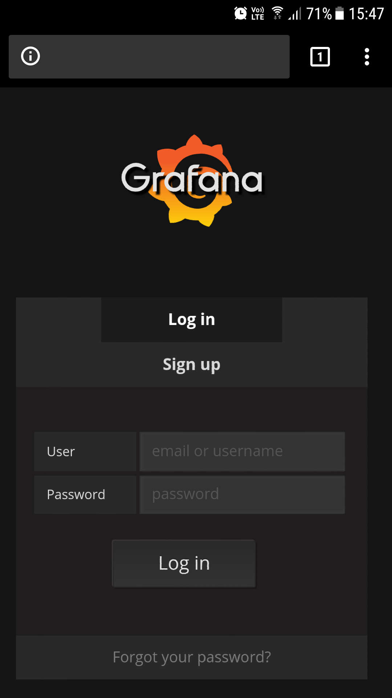
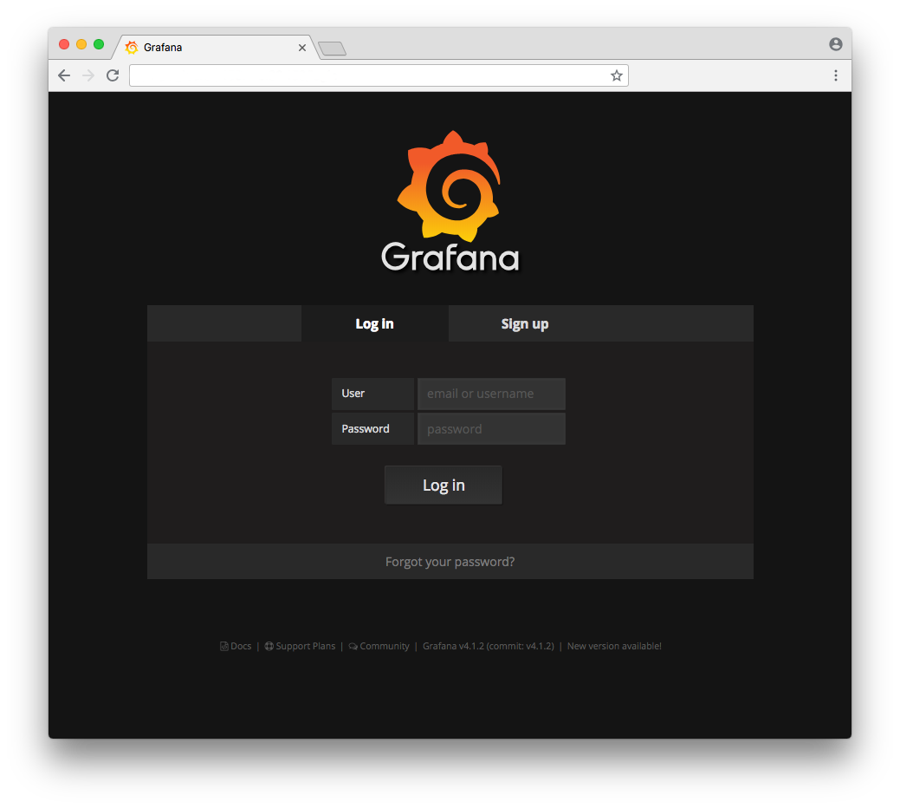

## 4. AVVIO DEI SERVIZI

Una volta ultimato l’editing dei file di configurazione si è pronti per l’avvio
di tutti i servizi.

Per poterli avviare in background digitare i seguenti comandi:

```bash
cd /opt/tdm-edge/
docker-compose up -d
```

Una volta avviati i servizi è possibile verificare che siano tutti online
digitando il comando

```bash
cd /opt/tdm-edge/
docker-compose ps
```

Se non ci sono stati problemi si avrà un output simile al seguente:


con tutti i servizi nello stato Up.

### 4.1 ACCESSO ALLA DASHBOARD LOCALE
Da questo momento, se tutti i passaggi sono stati effettuati correttamente ci
si può collegare alla dashboard locale ‘Grafana’.

1. In un web browser, da un PC collegato alla stessa rete dell’Edge Gateway,
   aprire la pagina all’indirizzo IP dell’Edge Gateway ricavato nel punto
‘Configurazione WiFi domestica sull’Edge Gateway’.
2. Alla richiesta di nome utente e password, inserire:

  ```
User: admin
Password: admin
  ```

3. Da questo punto è possibile configurare Grafana per accedere al database
   locale InfluxDb e configurare la dashboard.

Documentazione ufficiale di Grafana con istruzioni per la configurazione (in
lingua inglese): <http://docs.grafana.org/>.

 |  |
--- | ---

Pagina di accesso di Grafana: Smartphone (sinistra) e PC (destra) |
--- |

