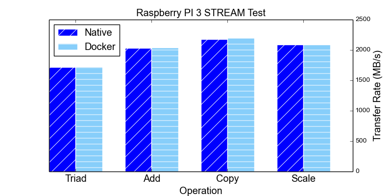
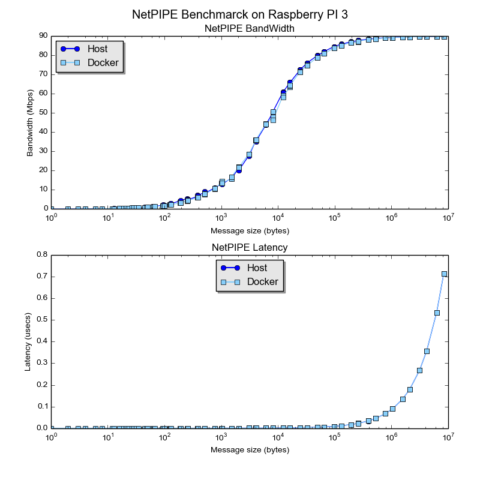
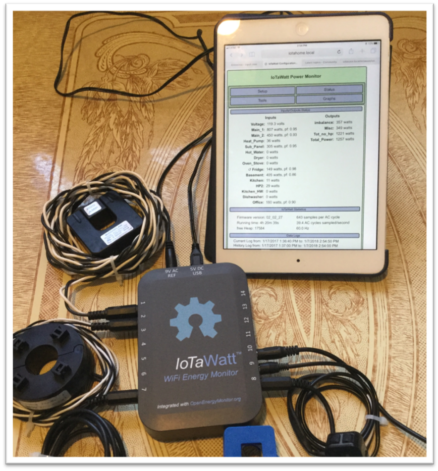

## 5. THE HARDWARE PLATFORM OF EDGE GATEWAY
### 5.1 EVALUATED HARDWARE SOLUTIONS
In order to prototype the Edge Gateway three embedded platforms have been evaluated: the BeagleBone Black and Raspberry PI (2-B and 3-B model).
All three platform satisfy low cost and availability requirements, being
easily purchased on e-commerce with costs between 30 and 80 euros. Moreover they have a large community of developers and users. Countless forums,
dedicated portals and blogs also provide documentation, assistance and examples
of applications that make it ideal platforms for educational purposes.

#### 5.1.1 BEAGLEBONE BLACK
The BeagleBone Black is a single-board computer (SBC) manufactured by Texas Instruments along with Digi-Key and Newark Element14. It is provided with a 32 bit ARM Cortex-A8 CPU bit with a maximum frequency of 1GHz and 512 MB DDR3 RAM. The single core processor has two programmable embedded Real-Time units. A large set of low level peripherals such as UART, CAN, I2C/SPI, ADC, USB are available.
The board storage resources are composed by 4GB onboard memory and a microSD player card.  
Network connectivity is provided by an integrated 100 Mbit/s ethernet network card. Wireless connectivity is missing but can be added through an external USB device. The estimated power consumption is 210-460 mA with a 5V power supply.

#### 5.1.2 RASPBERRY PI 2
The Raspberry Pi are a series of SBCs developed in the United Kingdom by the
Raspberry Pi Foundation. The main goal of the project was to provide a simple platform to teach computer science and programming basics in schools and deveoping countries. The Raspberry PI 2 features a Broadcom System-on-Chip (SoC) based on a 4 core 32-bit ARM Cortex-A7 processor with a maximum frequency of 900 MHz and 1 GB of DDR2 RAM. The storage consists of only a microSD card reader. No on-board storage device is present. The low level peripherals provided by the SoC are: GPIO, UART, I2C/SPI, USB and interfaces for Camera and Display. Unlike the BeagleBone Black, Analog/Digital converters (ADC) and the CAN Bus controller are missing. 

Network connectivity is provided by an integrated 100Mbit/s ethernet network card. No built-in wireless capabilty is available but it can be easily added via an external USB device. Estimated current consumption is about 800 mA with 5V power supply.

#### 5.1.3 RASPBERRY PI 3
The Raspberry Pi 3 is an evolution of the Raspberry PI 2. It features a SoC based on a quad-core 64 bit ARM Cortex- A53 processor and provides both a WiFi 802.11n chip and a BLE integrated Bluetooth. The
maximum CPU frequency increases up to 1.2GHz. The 1 GB DDR2 RAM and SoC low level peripherals do not change with respect to the Raspberry PI 2.
As the RPi 2, the RPi 3 storage resources consist of a microSD card reader without on-board storage devices. 
Network connectivity is provided by a 100 Mbit/s network integrated card (NIC). Estimated current consumption ranges from 300mA, 1.5W at rest,
up to 1.34 A, 6.7 W under load (5V supply voltage). Nevertheless, 
manufacturers suggest using power supplies capable of delivering
at least 2.5 A to avoid file system corruption and odd behaviour.

### 5.2 BENCHMARKS AND CHOICE OF HARDWARE PLATFORM
To make the Edge Gateway software working properly it was mandatory to evaluate the capabilities provided by the three platforms by means of different benchmarks.
A foundamental requirement was the compatibility of the SBCs with with the system of Docker container. To check both this feature and the computational capability the Linpack and Coremark benchmark have been used. Linpack measures the performance of floating-point operations while the Coremark tests algorithms used in embedded systems such as CRCs. As shown by the two following graphs, tests ran both in the native environment (Arch Linux) and within a Docker container.

  |
-------------------------|
 |

Both benchmarks show that no overhead is present if the execution of the code if performed within a Docker container.
Moreover the Raspberry PI 3 appears to be the most powerful SBC among the three competitor. For this reason all the next benchmark results are reported only for this platform. 

The performance of memory have been measured with the STREAM benchmark. STREAM belongs to the suite HPCC and is used to evaluate the bandwidth of RAM memory than different types of access (for example, Triad refers to a access of the type: a[i] = b[i] + c[i]*scale and represents the most onerous case). From the diagram, there results a substantial equivalence between the operations performed in a native environment and inside a Docker container.

 |
----------------------------|

The synthetic benchmark FIO has been used to measure the I/O performances of a class 10 SD card. FIO is a very flexible tool that allows to generate different patterns of data transfert. Both sequential and random read/write performances are shown in the following graphs. The horizontal axis specifies the block size used whereas the vertical one shows the bandwidth measured in kB/s. A little decrease of I/O performance is noticeable for random reads using a block size in the range 4-64KB if the benchmark runs within Docker. 

 |
-----------------------------|

The last benchmark, NetPIPE, measures the networking performances. Specifically, graphs show the latency and bandwidth of a communication between two processes that send back and forth a message. The measures are performed with different message size, regardless the protocol used. As well as the previous benchmarks, the impact of Docker on the SBC performance is negligible.

 |
-----------------------------|

The tests showed that the Raspberry PI 3 provides the highest computational power with respect to the other two platform. The RPI 3 integrates a wireless connectivity but lacks Analog/Digital converters (ADC) and on-board memory. Its requirements in term of power consumption is higher than the other two SBC (at least 2.5A at 5V DC).
However, the most important result is that using Docker containers enables a high degree of flexibility with a negligible impact on performance. 

### 5.3 SENSORS

In order to start the development of the Edge Gateway and the collateral activities of the project, it was needed to select some measure systems and sensors to be integrated with the Edge Gateway.

#### 5.3.1 WEATHER/ENVIRONMENTAL MEASURING STATION
To integrate the capabily of weather and environmental monitoring in the Edge Gateway, three open source and open hardware projects have been identified:

* The Smart Citizen Kit, SCK (<https://smartcitizen.me/>), a portable device able to measure temperature, humidity, light, sound, CO and NO2;

* The Arduino Weather Station Project, AWSP
  (<http://cactus.io/projects/weather/arduino-weather-station>), a not portable  platform with with sensors for atmospheric pressure, temperature, humidity, precipitation and wind speed and direction;

* The Stuttgart Fine Dust Sensor, SFDS
  (<https://luftdaten.info/en/construction-manual/>) able to measure  temperature, humidity and PM10/PM2.5 particulate matter.

The SFDS was selected to perform the preliminar tests of the Edge Gateway because its architecture and software allowed a fast integration. Moreover, some of the AWSP sensors were added to the SFDS obtaining a single expandable and versatile platform.

The connectivity of the SFDS is ensured by the integrated WiFi chip that can act as both access point (for the first configuration) and WiFi client to access to the network and send information to the selected server for data gathering and visualization.

SFDS supports different remote servers including the InfluxDB database and Rest API based systems. However, it does not provide a local storage and data can not be stored and retransmitted  if no connectivity is available. This limitation can be removed using the native connection to the Edge Gateway.

Weather diagrams as shown by *Grafana*|
------------------------------------------------------|
 |

#### 5.3.2 ENERGY MONITOR
During the development and test of the Edge Gateway, the IotaWatt system was selected as energy monitor.
IotaWatt is an accurate, multi-channel electrical monitoring system. It is open-hardware, open-source, low cost and easy to use and is based on a IoT platform with WiFi connectivity. The sampling of the signals is performed by using a 12 bit ADCs. The system provides an integrated Real Time Clock and a SD card to store acquired data. Furthermore, it supports the function of data querying with the web server and transmission to the cloud. 
The main features are:

*14 acquisition channels;
*REST API for data extraction
*Supports different brand, model and capacity current sensors
*Supports generic definition of any current sensor
*Configuration and display based on local LAN browser
*Open Hardware/Software
*Cloud supported influxDB and Emoncms.org

The software samples the input channels at the speed of 35-40 channels per second, storing the voltage (V), power (Watt) and energy (kWh) to the SD card every five seconds. Data can be displayed locally using a WiFi network or sent to a remote server Emoncms or influxDB database. If connectivity is temporary down, IotaWatt will continue to record locally, to update the server as soon as the networking will be restored.

IoTaWatt system|
------------------------------------------------------|
 |