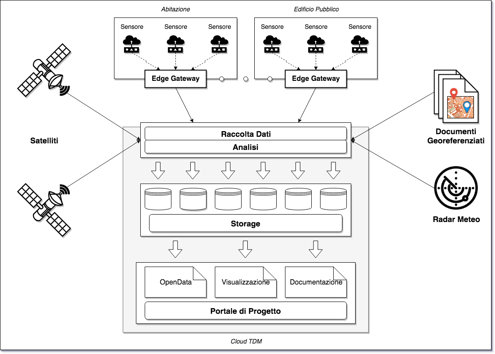

## 2. OVERVIEW DELL’ARCHITETTURA DI ACQUISIZIONE ED AGGREGAZIONE

Negli ultimi anni, l’offerta di servizi messi a disposizione dalle città ai
propri i cittadini ha visto una rapida espansione grazie all’utilizzo, affianco
ai tradizionali veicoli informativi, di nuovi strumenti digitali. Inoltre anche
la quantità e la qualità di informazioni disponibili è notevolmente aumentata,
in parte per il costante impegno delle istituzioni a pubblicare i propri
*dataset* come *OpenData* e in parte per la creazione di nuove informazioni,
elaborate o rappresentate in altre forme, partendo da dati iniziali. Il ruolo
stesso del cittadino è ribaltato. Da *utente* dei servizi cittadini diviene
*sorgente* delle informazioni che questi servizi utilizzano.

Temi quali sicurezza ambientale, consapevolezza energetica e del patrimonio
storico/culturale coinvolgono sempre più il cittadino come *fruitore*
dell’informazione, ma soprattutto come *fornitore* di dati. Il dato diviene
quindi estremamente ubiquo, generato in modi diversi, con risoluzioni e qualità
differenti. A questa nuova sorgente si affiancano poi le tradizionali fonti,
spesso più precise e standard ma più costose e meno flessibili. Per trarre
nuovi servizi occorre quindi porre assieme nuovi tipi di informazioni con
informazioni tradizionali, nuovi canali con i classici.

Tra le attività di qualsiasi sistema scalabile di acquisizione dati c’è,
quindi, l’utilizzo di piattaforme hardware a basso costo distribuibili sul
territorio. Nell’ambito del progetto TDM, in particolare, utilizzeremo questi
sensori per monitorare parametri meteo-ambientali e di consumo elettrico.

Il metodo di acquisizione di tutti questi dati deve essere calibrato sul tipo
di dato e sullo strumento che lo genera. In particolare le misure da sensori
possono essere acquisite da dispositivi di tipo diverso e distribuite su un
ampio territorio e si pone quindi il problema si trasmettere efficacemente la
mole di dati generata in un formato di messaggio *standard* per la raccolta e
l'immagazzinamento.

Si rende necessario perciò porre tra sensori sul campo e *cloud* di
acquisizione un dispositivo di raccolta e inoltro dei dati che disaccoppi
l’acquisizione della misura dall’invio e sopperisca ai limiti dei sensori
stessi. Limitate capacità della rete, congestione, interruzioni, ridotte
risorse computazionali e di memorizzazione, inadeguati o assenti strumenti di
sicurezza nelle comunicazioni, dispositivi di connessione assenti sono alcuni
dei problemi tecnologici che s’incontrano impiegando ad esempio sensori
economici facilmente accessibili ai comuni cittadini. E di questi problemi
occorre tenere conto in fase di progettazione di un sistema pensato per essere
impiegato anche con dati e in campi non ancora immaginati. All’interno del
progetto TDM, questo componente di raccolta locale e inoltro prende il nome di
Edge Gateway.  

L’integrazione di dati provenienti da un Edge Gateway all’interno di
un’architettura scalabile di aggregazione, processamento e restituzione è
esemplificata nella seguente figura, che mostra le diverse componenti del
progetto TDM. 

La raccolta centrale dei dati provenienti dall’Edge Gateway, così come di altre
sorgenti quali immagini satellitari, radar meteorologico, mappe e altri dati
statici georeferenziati avviene nel *cloud* TDM utilizzando una *Lambda
Architecture*. I dati, appena giunti, vengono pre-processati in quella che è
chiamata elaborazione in *stream*, e che risponde a necessità *real-time* date
da aggiornamenti dei dati. Allo stesso tempo, i dati ricevuti, assieme a quelli
pre-processati vengono salvati nei sistemi di *storage BigData* dove rimangono
disponibili per lavorazioni successive. Parte di questi poi alimentano
elaborazioni più lunghe, che richiedono più dati e risultati meno tempestivi,
le cosiddette elaborazioni *in batch*. Elaborazioni batch sono ad esempio le
previsioni meteorologiche a breve periodo (*Nowcasting*), le analisi storiche
dei consumi energetici, la creazione di modelli di per la visualizzazione. Come
per tutti gli altri dati, anche i risultati delle elaborazioni in batch sono
archiviate nello storage. I dati, poi, possono essere restituiti attraverso
componenti di visualizzazione integrate in un *portale integrato di progetto*.

L’Edge Gateway qui descritto è di uso generale, ed è stato specificatamente
realizzato per essere utilizzato con altre infrastrutture basate su FIWARE
diverse da TDM o con cloud IoT. In particolare, inserendo un edge gateway
standardizzato, con capacità di processamento e memorizzazione locali, tra la
sensoristica ed il cloud, si ottengono notevoli vantaggi, tra i quali la
possibilità di una prima aggregazione locale dei segnali provenienti da più
sensori e di trasmetterli verso l’infrastruttura di raccolta dati e analisi.
Inoltre, assicurando la presenza negli aggregatori locali di una sufficiente
potenza di calcolo e storage, a questi compiti si aggiunge anche quello di una
prima memorizzazione dei dati ed elaborazione e filtraggio. Questa capacità,
permette quindi di ridurre la quantità di dati trasferiti e la frequenza di
invio, nonché di fornire agli stessi dispositivi collegati una risposta in
tempo reale, per applicazioni di controllo e non solo monitoraggio. Inoltre, è
possibile anche poter gestire un primo accesso al dato senza nessuna
trasmissione in rete, il che permette di sviluppare diversi livelli di accesso
e di controllo della privacy.
